# Restcomm Statistics Service

The Restcomm Statistics Service is a web application that processes statistics collected on the modules restcomm platform.

This application persists the collected data into a database and displays the results via a dashboard or through a rest api.

This manual describes step by step to install the application on a OpenShift environment.

**Installation Instructions (Openshift Enviroment)**

First, you need to create an account on OpenShift environment. (https://www.openshift.com/).

**Step 01 -** Create a New Application

Click on link create you first application now...

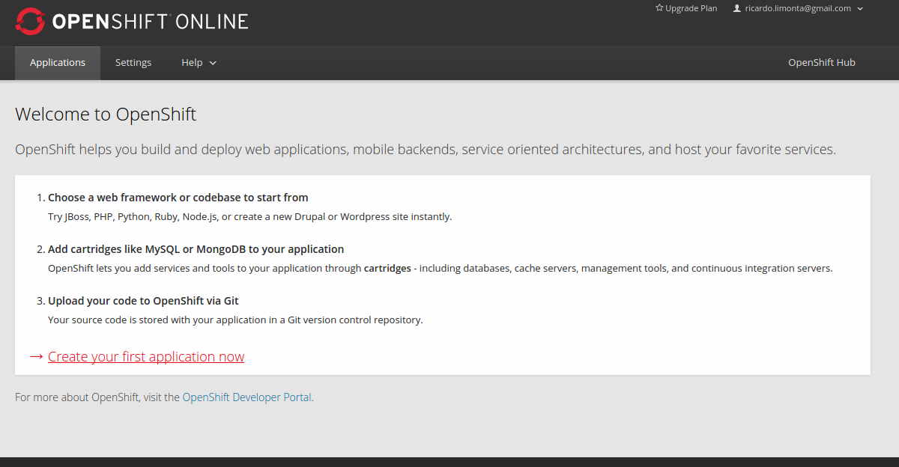

**Step 02 -** Select Wildfly 10 App Server (current version)

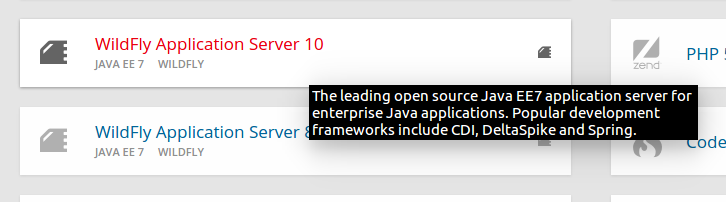

**Step 03 -** Define your Public URL

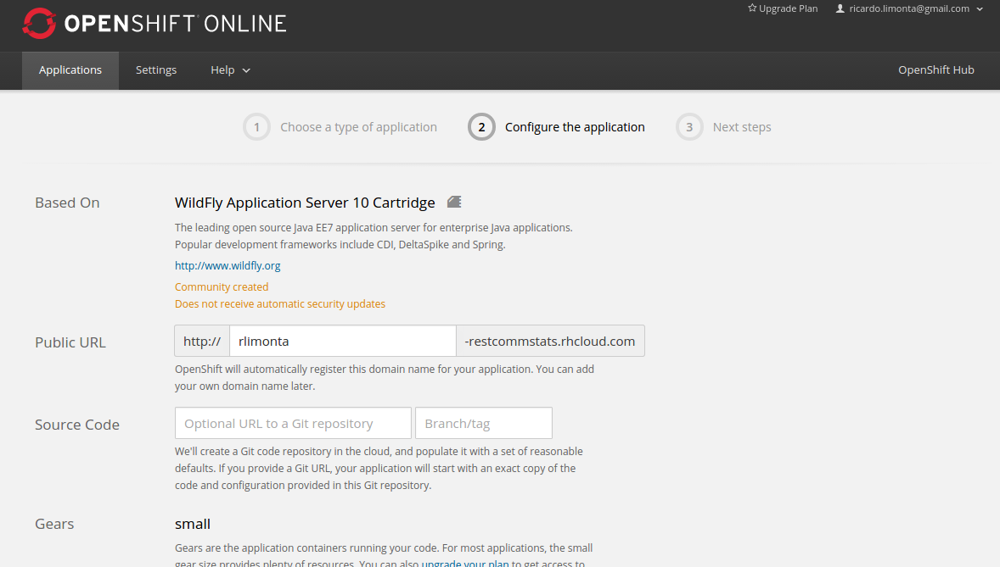

continue...

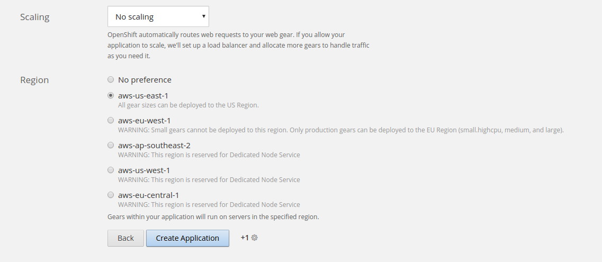

And click on Create Application button.

After that, it will be presented the entire information of the new environment.

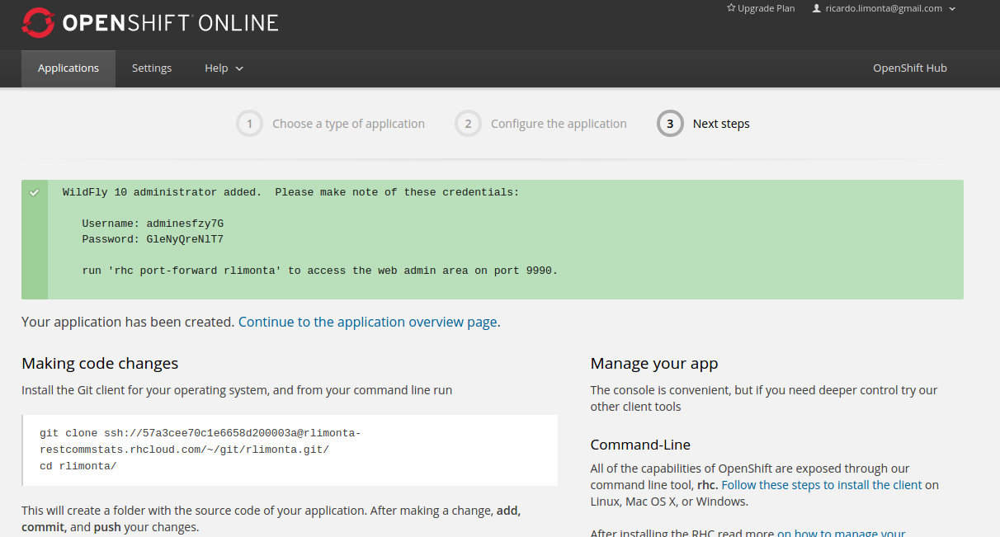

**Step 04 -** Add MongoDB

Click on Continue to the application overview Page

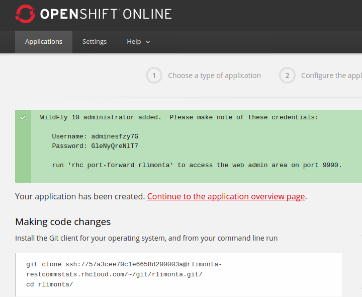

And select Add MongoDB 2.4 (current version)

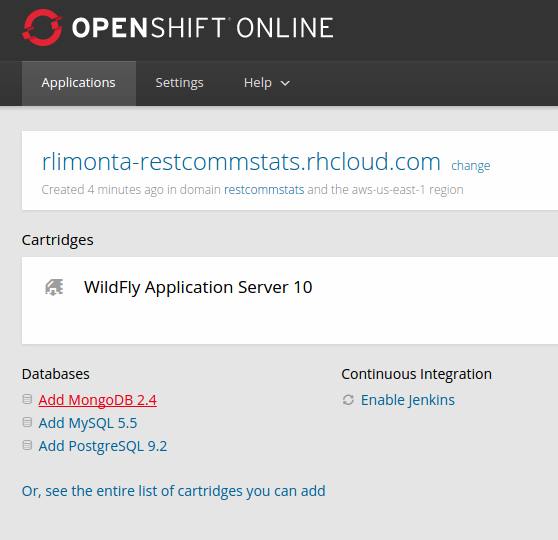

Now your enviroment are complete!

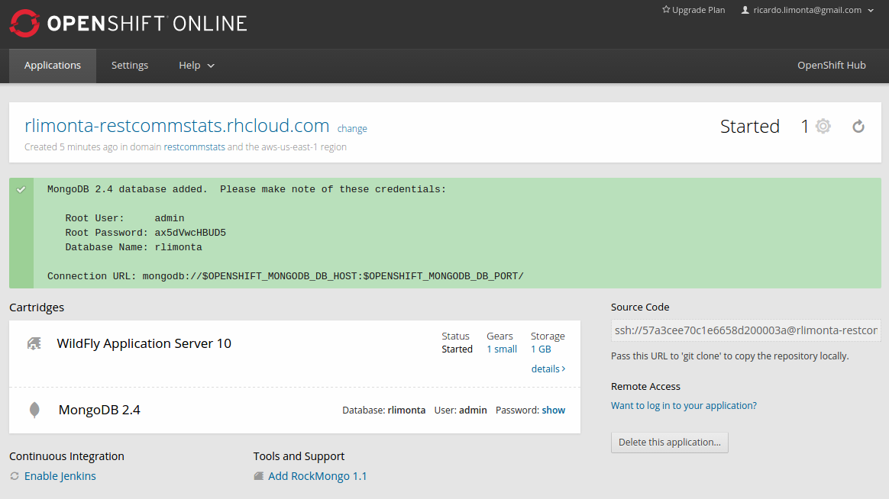

**Step 05 -** Generate Public SSH KEY

Now you need to create a public SSH Key and add to your environment (for remote access).

Example of Generating Public SSH Key (linux enviroment).

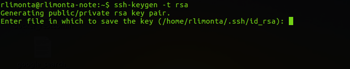

Put the generated key in Openshit Enviroment. Click in Settings menu and add public key button. 

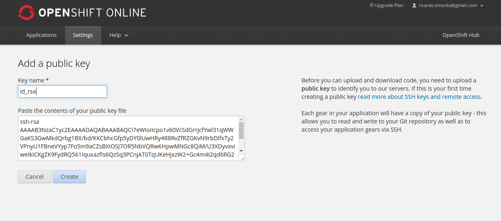

**Step 06 -** Create Application Admin Account

Now you need to create an application administrator account to access the web module. The web portal uses JAAS API to perform user authentication.

Access you enviroment using ssh:

**ssh [you enviroment url]**

Go to wilfly/bin directory

**cd wildfly/bin**

Now you need run **./add-user.sh** script

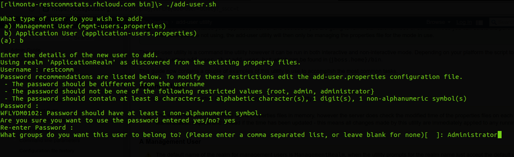

01) Select **(b) Application User**

02) Define your **username**;

03) Define your **password**;

04) Define your group name called **Administrator**. This is very important because the web module uses this group internally. 

**Step 07 -** Deploy Statistics Web Module

In this step you need make a git clone of https://github.com/RestComm/statistics-service and put **.war** file into deployments folder.

**Finally -** Access the web portal

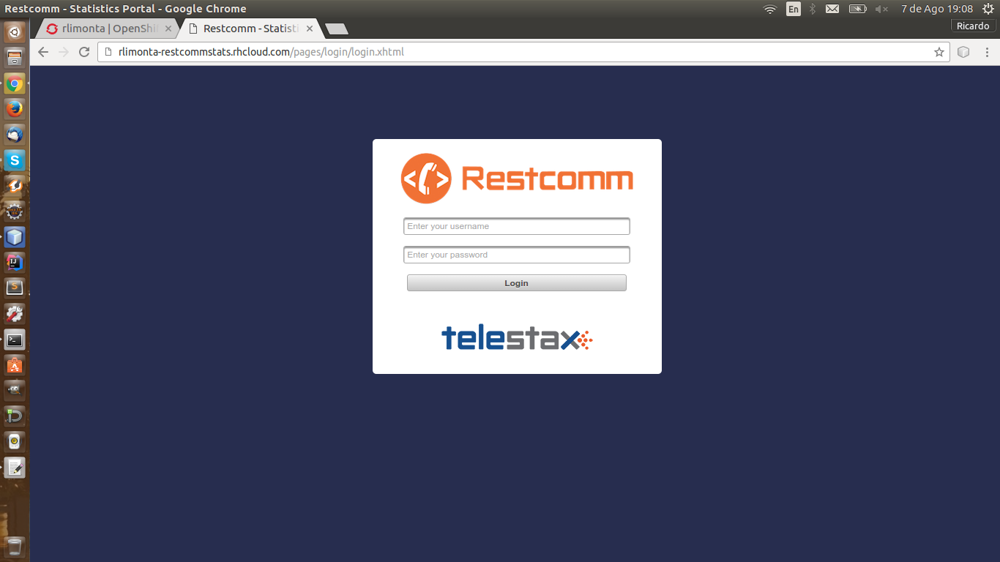

Put you **username** and **password**.

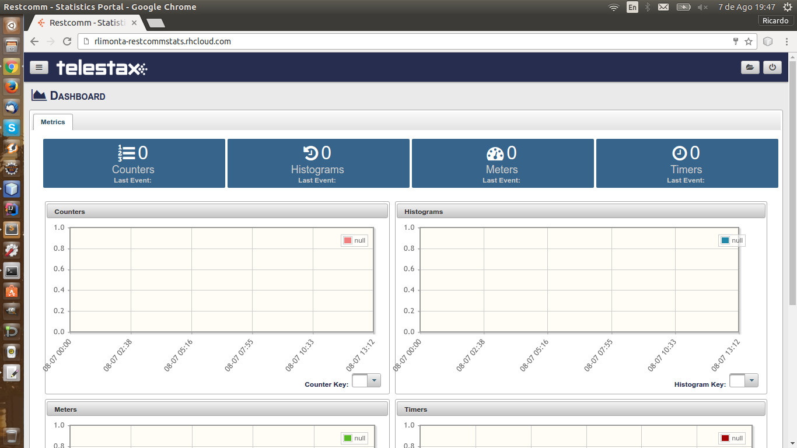

Then you must make a git clone of your OpenShift environment. 
Example:

_git clone ssh://[you enviroment url]_

